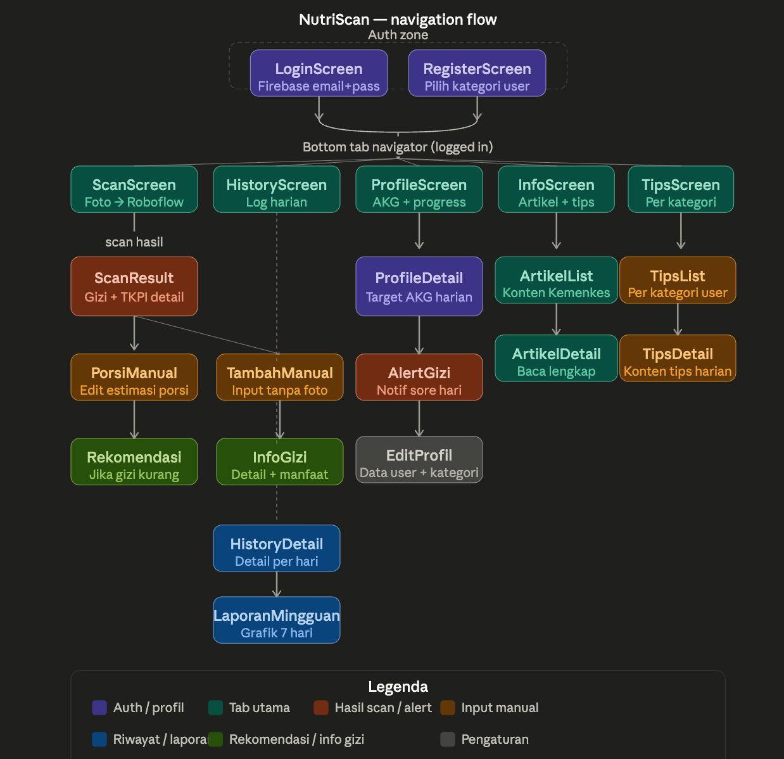

# NutriScan 🥗

Aplikasi **nutrition scanner** untuk masyarakat Indonesia berbasis React Native + Expo. Dirancang khusus untuk dua kategori pengguna: **ibu hamil** dan **orang tua dengan balita**, dengan standar gizi mengacu pada AKG Kemenkes 2019.

---

## Daftar Isi

- [Tentang Aplikasi](#tentang-aplikasi)
- [Tech Stack](#tech-stack)
- [Kategori Pengguna](#kategori-pengguna)
- [Fitur](#fitur)
- [Halaman & Navigasi](#halaman--navigasi)
- [Struktur Folder](#struktur-folder)
- [Setup & Instalasi](#setup--instalasi)
- [Environment Variables](#environment-variables)
- [Kontribusi](#kontribusi)

---

## Tentang Aplikasi

NutriScan membantu ibu hamil dan orang tua balita memantau kecukupan gizi harian melalui:

- Deteksi makanan otomatis menggunakan foto (Roboflow AI + Google Gemini)
- Pencocokan data gizi dari database nutrisi lokal
- Pemantauan progress harian terhadap target AKG personal
- Artikel dan tips gizi berdasarkan kategori pengguna
- Profil pengguna dengan target AKG yang dipersonalisasi

---

## Flow Aplikasi


## Tech Stack

| Komponen | Teknologi |
|---|---|
| Framework | React Native + Expo (Expo Router) |
| AI Deteksi Makanan | Roboflow API + Google Gemini API |
| Database Gizi | Data nutrisi lokal (JSON) |
| Autentikasi | Firebase Authentication (email + password) |
| Penyimpanan Lokal | AsyncStorage |
| Styling | NativeWind (Tailwind CSS) |
| Navigasi | Expo Router (file-based routing) |

---

## Kategori Pengguna

### Ibu Hamil
Target AKG disesuaikan per trimester (Trimester 1, 2, 3) berdasarkan standar Kemenkes 2019. Nutrien prioritas: folat, zat besi, kalsium, vitamin D, protein.

### Balita (dikelola orang tua)
Target AKG disesuaikan berdasarkan usia anak (0–5 tahun). Nutrien prioritas: protein, kalsium, vitamin A, zat besi, energi total.

---

## Fitur

- Login & Register dengan Firebase Authentication (multi-step form)
- Forgot Password via Firebase
- Pilih kategori user saat registrasi (ibu hamil / balita, usia, trimester)
- Data AKG Kemenkes 2019 per kategori dalam format JSON lokal
- Scan makanan via kamera / galeri → Roboflow + Gemini → hasil gizi
- History makanan harian dengan log per tanggal
- Profile Screen dengan target AKG personal
- Tips Gizi Harian — konten per kategori (ibu hamil / balita)
- Artikel Kesehatan — konten edukasi gizi, bisa search & filter
- Notifikasi reminder gizi harian

---

## Halaman & Navigasi

### Auth
| Halaman | Tujuan | Fitur Utama |
|---|---|---|
| `LoginScreen` | Masuk akun | Email + password, Firebase Auth |
| `RegisterScreen` | Buat akun baru | Multi-step: pilih kategori, usia, trimester / usia anak |
| `ForgotPasswordScreen` | Reset password | Email, Firebase password reset |

### User
| Halaman | Tujuan | Fitur Utama |
|---|---|---|
| `ScanScreen` | Deteksi makanan | Kamera / galeri → Roboflow + Gemini |
| `HistoryScreen` | Log makanan harian | List per tanggal, total gizi, progress AKG |
| `ProfileScreen` | Dashboard AKG + progress | Target per nutrien, info pengguna |
| `TipsListScreen` | Tips gizi harian | Filter per kategori user |
| `TipsDetailScreen` | Baca tips lengkap | Konten, ilustrasi, referensi |
| `ArtikelListScreen` | Artikel kesehatan | Search, filter, konten edukasi |
| `ArtikelDetailScreen` | Baca artikel penuh | Konten panjang, bookmark |

---

## Struktur Folder

```
nutriscan/
├── App.js                        # Entry point
├── index.js                      # Expo root
├── app.json                      # Expo config
├── babel.config.js
├── metro.config.js               # Metro bundler config
├── tailwind.config.js            # NativeWind config
├── global.css                    # Global styles
├── eas.json                      # EAS Build config
├── package.json
│
└── app/
    ├── context/
    │   └── AuthContext.js         # Firebase auth state
    │
    ├── data/
    │   ├── akgData.js             # AKG Kemenkes 2019
    │   ├── artikelData.js         # Konten artikel
    │   ├── nutrisiDatabase.js     # Database nutrisi lokal
    │   └── tipsData.js            # Tips per kategori
    │
    ├── screens/
    │   ├── auth/
    │   │   ├── LoginScreen.js
    │   │   ├── RegisterScreen.js
    │   │   ├── ForgotPasswordScreen.js
    │   │   ├── components/
    │   │   │   ├── Step1Form.js
    │   │   │   └── Step2Form.js
    │   │   └── hooks/
    │   │       └── useRegister.js
    │   │
    │   ├── user/
    │   │   ├── ScanScreen.js
    │   │   ├── HistoryScreen.js
    │   │   ├── ProfileScreen.js
    │   │   ├── TipsListScreen.js
    │   │   ├── TipsDetailScreen.js
    │   │   ├── ArtikelListScreen.js
    │   │   ├── ArtikelDetailScreen.js
    │   │   └── hooks/
    │   │       ├── useArtikel.js
    │   │       ├── useHistory.js
    │   │       ├── useProfile.js
    │   │       ├── useTips.js
    │   │       └── useUserProfil.js
    │   │
    │   └── admin/                 # Admin panel (coming soon)
    │
    ├── theme/
    │   └── colors.js              # Theme colors
    │
    └── utils/
        ├── firebaseConfig.js      # Firebase init
        ├── geminiConfig.js        # Gemini AI config
        ├── geminiHelper.js        # Gemini helper utilities
        ├── roboflowConfig.js      # Roboflow API config
        ├── artikelConfig.js       # Artikel config
        └── foodIcon.js            # Food icon mapping
```

---

## Setup & Instalasi

### Prasyarat
- Node.js >= 18
- Expo CLI: `npm install -g expo-cli`
- Akun Firebase (untuk Auth)
- API Key Roboflow (untuk deteksi makanan)
- API Key Google Gemini (untuk analisis gizi)

### Langkah Instalasi

```bash
# Clone repositori
git clone https://github.com/Radhitndrm/NutriScanBeta.git
cd NutriScanBeta

# Install dependencies
npm install

# Salin file environment
cp .env.example .env
# Isi variabel di .env (lihat bagian Environment Variables)

# Jalankan di Expo Go
npx expo start
```

Scan QR code di Expo Go (Android/iOS) untuk menjalankan aplikasi.

---

## Environment Variables

Buat file `.env` di root proyek:

```env
EXPO_PUBLIC_FIREBASE_API_KEY=your_firebase_api_key
EXPO_PUBLIC_FIREBASE_AUTH_DOMAIN=your_project.firebaseapp.com
EXPO_PUBLIC_FIREBASE_PROJECT_ID=your_project_id
EXPO_PUBLIC_FIREBASE_STORAGE_BUCKET=your_project.firebasestorage.app
EXPO_PUBLIC_FIREBASE_MESSAGING_SENDER_ID=your_sender_id
EXPO_PUBLIC_FIREBASE_APP_ID=your_app_id
EXPO_PUBLIC_GEMINI_API_KEY=your_gemini_api_key
EXPO_PUBLIC_ROBOFLOW_API_KEY=your_roboflow_api_key
```

> ⚠️ Jangan pernah commit file `.env` ke repositori. Pastikan `.env` sudah masuk ke `.gitignore`.

---

## Kontribusi

1. Fork repositori ini
2. Buat branch fitur: `git checkout -b fitur/nama-fitur`
3. Commit perubahan: `git commit -m "feat: deskripsi singkat"`
4. Push ke branch: `git push origin fitur/nama-fitur`
5. Buat Pull Request ke branch `main`

### Konvensi Commit

| Prefix | Kegunaan |
|---|---|
| `feat:` | Fitur baru |
| `fix:` | Perbaikan bug |
| `docs:` | Perubahan dokumentasi |
| `refactor:` | Refactor kode tanpa perubahan fungsional |
| `style:` | Perubahan UI/styling |
| `chore:` | Konfigurasi, dependency, dll |

---

## Referensi

- [Tabel Komposisi Pangan Indonesia (TKPI)](http://www.panganku.org)
- [Angka Kecukupan Gizi 2019 — Kemenkes RI](https://www.kemkes.go.id)
- [Roboflow Documentation](https://docs.roboflow.com)
- [Google Gemini API](https://ai.google.dev)
- [Expo Documentation](https://docs.expo.dev)
- [Firebase Auth — React Native](https://rnfirebase.io/auth/usage)

---

*NutriScan — Gizi Terpantau, Generasi Sehat* 🇮🇩
